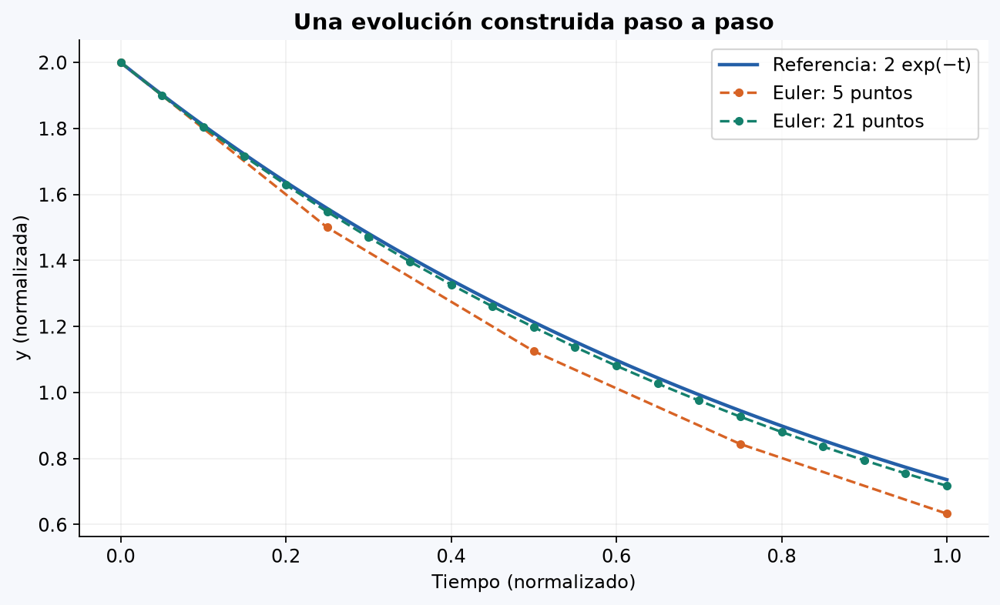

# 6. Euler: construir una trayectoria desde una regla de cambio

Código de referencia: [ivp_one.py](https://github.com/Santiago-Echeverri-Arteaga/Metodos_Numericos_Uniquindio/blob/a5c583075e984c3cc248afe5585200ca7cbfb5b9/examples/book_original/ivp_one.py). Autor del original: Alex Gezerlis, *Numerical Methods in Physics with Python*, segunda edición, 2023. La explicación y los ejemplos pequeños son material didáctico elaborado para Programación.

## Implementación documentada

Archivo: [euler.py](euler.py).

```python
euler(f, a, b, n, y_inicial)
```

Devuelve una lista de n pares (t,y). Realiza exactamente n−1 evaluaciones de pendiente, conserva la condición inicial y valida resultados finitos. La demostración usa y′=−y, y(0)=2 con variables normalizadas. Los tipos y el contrato completo están en la firma y el docstring.

Ejecuta desde la raíz del repositorio:

```bash
python guias/algoritmos_matematicos/euler.py
```

La demostración guarda la imagen sin abrir ventanas. Opciones: `--mostrar`, `--sin-grafica` y `--salida ruta`.



## Para qué sirve

A veces no conocemos una magnitud en cualquier instante, pero sí cómo cambia según su estado. Si f(t,y) da ese ritmo, una regla sencilla para avanzar h es:

```text
siguiente_y = actual_y + h * f(actual_t, actual_y)
siguiente_t = actual_t + h
```

Es Euler explícito. Lo aceptamos como aproximación para pasos adecuados, sin resolver ecuaciones diferenciales simbólicamente. Hay que usar el estado anterior correctamente y guardar cada pareja.

Para una cantidad que disminuye a un ritmo proporcional a lo que queda, podemos usar f(t,y)=−y con unidades normalizadas. Desde y=2, el cambio depende del valor actual, no solo del inicial.

## Contrato

Entradas: f, tiempo inicial a, final b>a, entero n>=2 de **puntos** y valor yinit. El paso es `(b-a)/(n-1)`.

Salida: n pares (t,y), incluyendo inicial y final. Se requieren n−1 actualizaciones. f debe estar definida en los estados usados; no se garantiza validez para cualquier modelo.

## Recorrido manual

Con a=0, b=1, n=5 e yinit=2, h=0,25:

| t | y guardado | Cambio para el siguiente punto |
|---:|---:|---|
| 0 | 2 | 0,25·(−2)=−0,5 |
| 0,25 | 1,5 | 0,25·(−1,5)=−0,375 |
| 0,5 | 1,125 | 0,25·(−1,125)=−0,28125 |
| 0,75 | 0,84375 | 0,25·(−0,84375)=−0,2109375 |
| 1 | 0,6328125 | No hace falta otro paso |

La referencia proporcionada es y(t)=2·exp(−t), cuyo valor final es aproximadamente 0,7357588823. La diferencia no demuestra que programaste mal Euler: aplicar bien una regla aproximada no equivale a obtener un valor exacto.

## Pseudocódigo con listas

```text
validar a, b y n
h = (b-a)/(n-1)
y = yinit
trayectoria = [(a, y)]
para i desde 0 hasta n-2:
    t = a + i*h
    nuevo_y = y + h*f(t, y)
    nuevo_t = a + (i+1)*h
    agregar (nuevo_t, nuevo_y) a trayectoria
    y = nuevo_y
devolver trayectoria
```

Calcular la pendiente en el nuevo tiempo o con el nuevo y sería otra operación. Si guardas antes de actualizar, empareja el estado anterior con el tiempo anterior.

## Correspondencia con `euler`

`xs` contiene tiempos y `ys` reserva espacio para valores. `y` es el estado actual. `enumerate(xs)` permite guardarlo en la posición j antes de actualizarlo.

El original actualiza una vez más después de guardar el último punto. Ese paso no se devuelve. Puede gastar una evaluación o producir un fallo innecesario de dominio. El pseudocódigo realiza exactamente n−1 pasos.

La f del archivo es más compleja, con divisiones por `1-x**2`, y se evalúa entre 0,05 y 0,49. Allí x es la variable independiente, que aquí llamamos tiempo. No cambies el intervalo a ciegas: el modelo no está definido en x=±1.

El archivo también contiene `rk4`: calcula cuatro incrementos y los combina antes de actualizar. Se identifica para reconocer otras reglas; su desarrollo queda fuera de esta guía.

## Qué implementar y comprobar

Traduce el pseudocódigo con una lista de tuplas. Para f(t,y)=0, todos los valores deben ser yinit. Para f(t,y)=3 debe dar la recta y=yinit+3·(t−a), salvo redondeo. Contrasta después el ejemplo de disminución con la tabla.

Comprueba n pares, condición inicial y último tiempo b dentro del redondeo esperado. Explica por qué n actualizaciones darían n+1 puntos si ya guardaste el inicial.

Considera h=2 con f(t,y)=−y: desde 2, un paso produce −2. El programa puede respetar la fórmula y dar una aproximación inadecuada para una cantidad que debería seguir positiva. La elección del paso y su análisis se desarrollan en Métodos Numéricos.

[Volver al índice](README.md).
